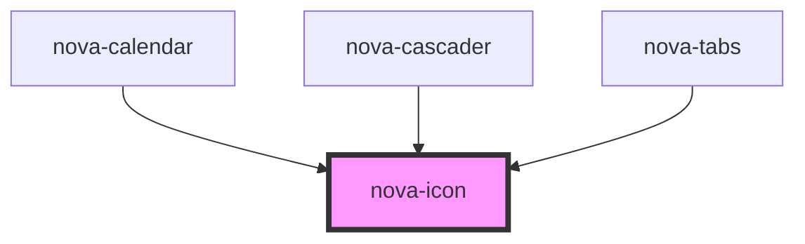

# nova-icon

<!-- Auto Generated Below -->

## Properties

| Property  | Attribute | Description | Type     | Default     |
| --------- | --------- | ----------- | -------- | ----------- |
| `color`   | `color`   |             | `string` | `"inherit"` |
| `name`    | `name`    | Props       | `string` | `""`        |
| `options` | `options` |             | `string` | `""`        |
| `pre`     | `pre`     |             | `string` | `"fas"`     |
| `size`    | `size`    |             | `string` | `""`        |

## Dependencies

### Used by

 - [nova-calendar](..\..\components\nova-calendar)
 - [nova-cascader](..\..\components\nova-cascader)
 - [nova-tabs](..\..\components\nova-tabs)

### Graph

----------------------------------------------

*Built with [StencilJS](https://stenciljs.com/)*
