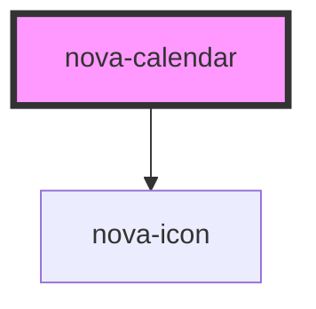

# nova-calendar

<!-- Auto Generated Below -->

## Properties

| Property  | Attribute | Description                                                                             | Type                | Default                                                                                       |
| --------- | --------- | --------------------------------------------------------------------------------------- | ------------------- | --------------------------------------------------------------------------------------------- |
| `card`    | `card`    | Changes the view to card                                                                | `boolean`           | `false`                                                                                       |
| `content` | `content` | Object that contains all data with the items of each date with events and configuration | `any`               | `{     data: {       items: {}     },     configuration: {       fullscreen: false     }   }` |
| `type`    | `type`    | Type of calendar, view by month or by year                                              | `"month" \| "year"` | `"month"`                                                                                     |
| `value`   | --        | Selected moment value                                                                   | `Moment`            | `moment()`                                                                                    |

## Methods

### `changeLocale(lang: string, localeSpec: object) => Promise<void>`

changeLocale

#### Returns

Type: `Promise<void>`

### `changeValue(newValue: any) => Promise<void>`

changeValue

#### Returns

Type: `Promise<void>`

### `fullscreen() => Promise<void>`

fullScreen

#### Returns

Type: `Promise<void>`

### `onChangeValue(Callback: Function) => Promise<void>`

onChangeValue

#### Returns

Type: `Promise<void>`

### `onSelectValue(Callback: Function) => Promise<void>`

onSelectValue

#### Returns

Type: `Promise<void>`

### `toggleType(type: "month" | "year") => Promise<void>`

toggleType

#### Returns

Type: `Promise<void>`

## Dependencies

### Depends on

- [nova-icon](..\..\atoms\nova-icon)

### Graph

----------------------------------------------

*Built with [StencilJS](https://stenciljs.com/)*
