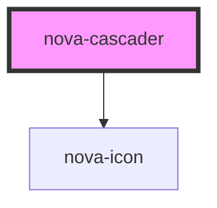

# nova-cascader

<!-- Auto Generated Below -->

## Properties

| Property  | Attribute | Description | Type                                     | Default                                                                                                                                                                                                                                                                |
| --------- | --------- | ----------- | ---------------------------------------- | ---------------------------------------------------------------------------------------------------------------------------------------------------------------------------------------------------------------------------------------------------------------------- |
| `content` | --        |             | `cascaderData & configuration & styling` | `{     data: {       items: []     },     configuration: {       expandTrigger: 'click',       name: '',       placeholder: 'Select',       autofocus: false,       readonly: false,       disabled: false,       separator: ' / ',       defaultValue: [],     }   }` |
| `size`    | `size`    |             | `string`                                 | `undefined`                                                                                                                                                                                                                                                            |

## Methods

### `blurCascader() => Promise<void>`

blurCascader

#### Returns

Type: `Promise<void>`

### `focusCascader() => Promise<void>`

focusCascader

#### Returns

Type: `Promise<void>`

### `onCascaderSelect(callback: cascaderCallback) => Promise<void>`

onCascaderSelect

#### Returns

Type: `Promise<void>`

### `onPopupChange(callback: cascaderCallback) => Promise<void>`

onPopupChange

#### Returns

Type: `Promise<void>`

## Dependencies

### Depends on

- [nova-icon](..\..\atoms\nova-icon)

### Graph

----------------------------------------------

*Built with [StencilJS](https://stenciljs.com/)*
