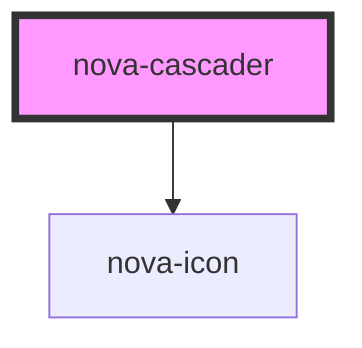

# nova-cascader

| Property  | Attribute | Description | Type | Default |
| --------- | --------- | ----------- | --- | --- |
| Content   | --  | Wrapper object for containing all the configurations | cascader | -- |
| expandTrigger | -- | Check what trigger is going to open the cascader, either click or hover | string | 'click' |
| name | --------- | Prop used for changing css classes | --- | '' |
| placeholder | --------- | Prop used for changing css classes | --- | 'Select' |
| autofocus | --------- | ----------- | --- | false |
| readonly | --------- | ----------- | --- | false |
| disabled | --------- | Prop utilized for disabling an option inside the cascader | --- | false |
| separator | --------- | The character used to separate the selections inside the cascader | --- | '/' |
| defaultValue | --------- | The default value that appears in the cascader initially | --- | [] |
| changeOnSelect | --------- | ----------- | --- | true |
| size | --------- | Changes the height of the input component of the cascader | --- | '' |

<!-- Auto Generated Below -->

## Properties

| Property  | Attribute | Description | Type                                                     | Default                                                                                                                                                                                                                                                                                           |
| --------- | --------- | ----------- | -------------------------------------------------------- | ------------------------------------------------------------------------------------------------------------------------------------------------------------------------------------------------------------------------------------------------------------------------------------------------- |
| `content` | --        |             | `cascaderData & cascaderConfiguration & cascaderStyling` | `{     data: {       items: []     },     configuration: {       expandTrigger: "click",       name: "",       placeholder: "Select",       autofocus: false,       readonly: false,       disabled: false,       separator: " / ",       defaultValue: [],       changeOnSelect: true     }   }` |
| `size`    | `size`    |             | `string`                                                 | `undefined`                                                                                                                                                                                                                                                                                       |

## Methods

### `addCustomTrigger(el: HTMLElement) => Promise<void>`

#### Returns

Type: `Promise<void>`

### `blurCascader() => Promise<void>`

blurCascader

#### Returns

Type: `Promise<void>`

### `focusCascader() => Promise<void>`

focusCascader

#### Returns

Type: `Promise<void>`

### `onCascaderSelect(callback: cascaderCallback) => Promise<void>`

onCascaderSelect

#### Returns

Type: `Promise<void>`

### `onPopupChange(callback: cascaderCallback) => Promise<void>`

onPopupChange

#### Returns

Type: `Promise<void>`

## Dependencies

### Depends on

- [nova-icon](..\..\atoms\nova-icon)

### Graph

----------------------------------------------

*Built with [StencilJS](https://stenciljs.com/)*
