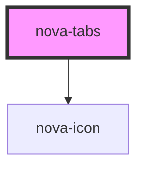

# nova-tabs

<!-- Auto Generated Below -->

## Properties

| Property     | Attribute  | Description | Type                                                                                    | Default                                                                                                                                                                |
| ------------ | ---------- | ----------- | --------------------------------------------------------------------------------------- | ---------------------------------------------------------------------------------------------------------------------------------------------------------------------- |
| `confjson`   | `confjson` |             | `any`                                                                                   | `undefined`                                                                                                                                                            |
| `datajson`   | --         |             | `{ items: any[]; }`                                                                     | `undefined`                                                                                                                                                            |
| `newTabData` | --         |             | `{ title: string; icon: string; enable: boolean; closable: boolean; content: string; }` | `{     title: "New tab",     icon: "plus-square",     enable: true,     closable: false,     content: "
Content of NewTab Pane

This is an added tab.
"   }` |
| `updater`    | `updater`  |             | `boolean`                                                                               | `true`                                                                                                                                                                 |

## Methods

### `addTab(tabData: any) => Promise<void>`

addTab

#### Returns

Type: `Promise<void>`

### `closeTab(keyIndex: number) => Promise<void>`

closeTab

#### Returns

Type: `Promise<void>`

### `onEdit(callback: Function) => Promise<void>`

onEdit

#### Returns

Type: `Promise<void>`

### `onTabClick(callback: Function) => Promise<void>`

onTabClick

#### Returns

Type: `Promise<void>`

### `openTab(keyIndex: any, event?: UIEvent) => Promise<void>`

openTab

#### Returns

Type: `Promise<void>`

## Dependencies

### Depends on

- [nova-icon](..\..\atoms\nova-icon)

### Graph

----------------------------------------------

*Built with [StencilJS](https://stenciljs.com/)*
